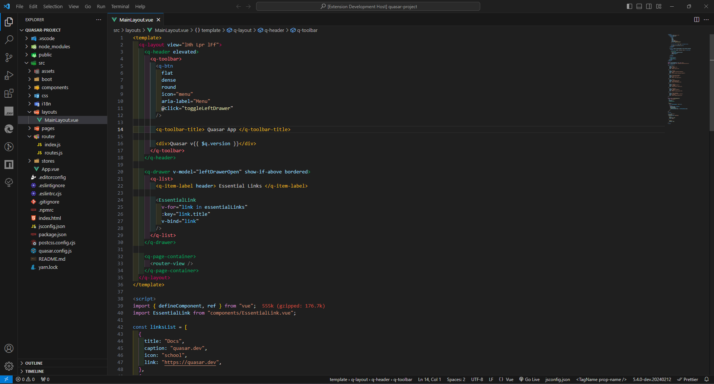
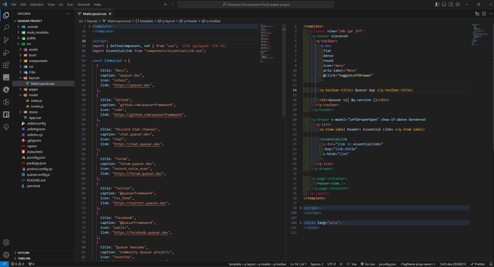
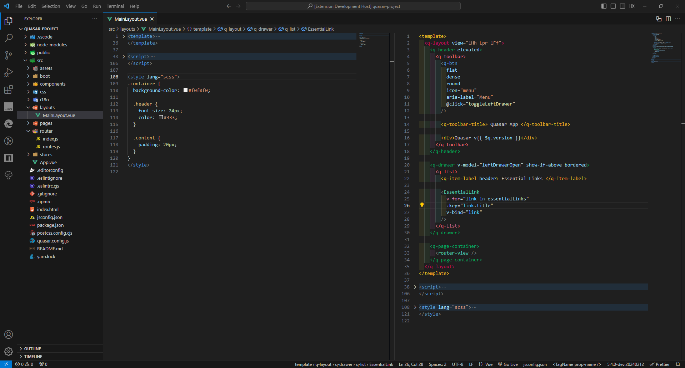

# vuesplitingroup README

The purpose is to view 2 sections of vue files: template/script || script/template || template/style || style/template.
“The location of the cursor affects the position of the right or left editor.” 🖱️✍️
This extension split a vue file into 2 editors.

## Features

Make sure you cursor is in the template or script section. Press ctrl+alt+z [macOS: cmd+alt+z] (the default shortcut key) to split current vue files into 2 editors template/script || script/template.
Make sure you cursor is in the template or style section. Press ctrl+alt+x [macOS: cmd+alt+x] (the default shortcut key) to split current vue files into 2 editors template/style || style/template.

> Tip: Many popular extensions utilize animations. This is an excellent way to show off your extension! We recommend short, focused animations that are easy to follow.

## Release Notes

Users appreciate release notes as you update your extension.

### 1.0.0

Initial release of ...

## For more information

- [github](https://github.com/selaimanh/vscode-vue-split-in-group)

**Enjoy!**
